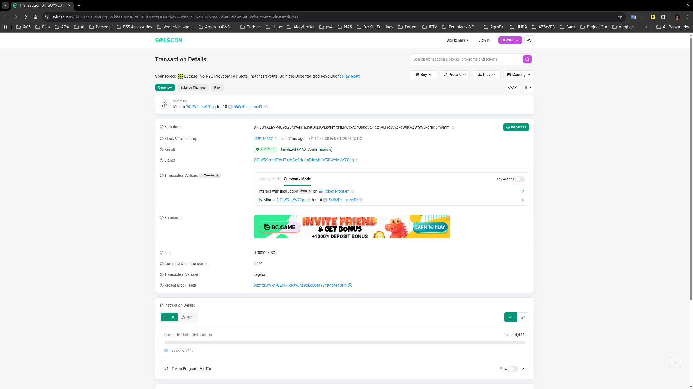
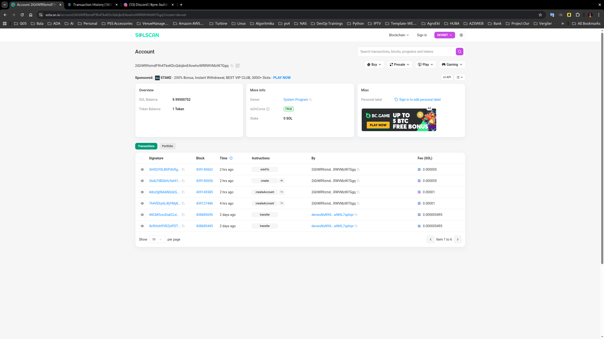
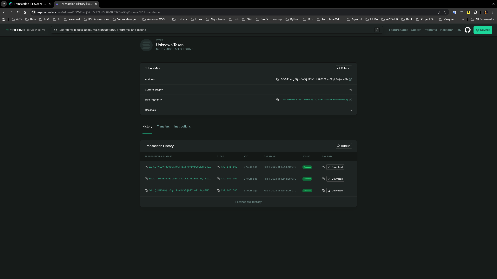

=======
# Q1_26_OIskenderov
Turbine trainings \ Rust Lang \ Anchor
=======

## ✅ README.md

````markdown
# Token Minting Proof (Solana / Anchor)

This repository contains proof of successful token minting performed in Devnet.

The purpose of this README is to provide verifiable evidence (screenshots + transaction data) for Pull Request review and approval.

---

## 📌 Environment

- Anchor Framework
- Rust
- Solana CLI
- Solscan verification

---

## 🪙 Minted Token Information

| Parameter            | Value                                  |
|----------------------|----------------------------------------|
| Token Mint Address   | `56WzPhuoj9QLv5nEQoSSb8ibNAC3ZGssDEqt9wjmnePb`             |
| Decimals             | `10n`                                                      |
| Authority            | `GrBSfbex6uxKjMEzaLD7VidGdtAeo17LzwNchyWQPqDx`             |

---

## 🔗 Minting Transaction

| Parameter              | Value                                  |
|------------------------|----------------------------------------|
| Transaction Signature  | `3iHSUYXLBVPdU9gGVXhwHTau5KUxDKPLsvKmrq4LM6tpvQnQpngut615x1yUiYo3yyZkgWrKwZWSW6kcrfMJmomm`                  |

You can verify the transaction using Solscan (custom RPC for localhost or replay on devnet if applicable).

---

## 📷 Screenshots

### 4️⃣ SolScan Verification,Transactions & History





### 5 SolExplorer Verification,Transactions & History




---

## ▶️ Steps Performed

1. Created token mint and minted tokens via spl_init.ts and spl_mint.ts.

2. Verified transaction by signature by solscan and solana-explorer

---

## 🧾 Proof Summary

This PR includes:

* Screenshots of the minting process
* Token mint address
* Transaction signature hash
* Evidence of successful deployment and execution


### Mint NFT Create

```
### My Awesome NFT

### nft_image:
Your image URI:  [
  'https://gateway.irys.xyz/28k7M1BtWCAyc28vZ63a5CqNLTfB49M6vzX1dUeWCduS'
]

### nft_metadata:
Your metadata URI:  https://gateway.irys.xyz/2ZchV9e3UJUFPXf7DJcMPLHLGUHRBgvnNmjGWuTuQQYX

### nft_mint:
Succesfully Minted! Check out your TX here:
[!https://explorer.solana.com/tx/4npzmW21jzkjX6GzC1ZHuBw7nqEE711PzTcruh924xSVnaFhhYRX2ti9ms4hDB7UK7pxqajTW6ArJrrgN8TYWqdZ?cluster=devnet]
Mint Address:  FZGJTAyRkMx5oHEJpmr2QvuSE5JX2wbzaAVEh9FqtTSX

[!https://explorer.solana.com/address/FZGJTAyRkMx5oHEJpmr2QvuSE5JX2wbzaAVEh9FqtTSX?cluster=devnet]

## 📷 Screenshots

[!Account_inputs]    (./images/nft_images/Account_inputs.png)
[!Activity]         (./images/nft_images/Activity.png)
[!Collectibles]     (./images/nft_images/Collectibles.png)
[!portfolio]       (./images/nft_images/portfolio.png)
[!Transaction_hist] (./images/nft_images/Transaction_hist.png)
[!Transaction_send] (./images/nft_images/Transaction_send.png)

## 👤 Author

**Orkhan Iskandarov**
